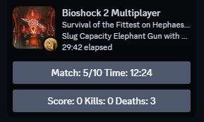
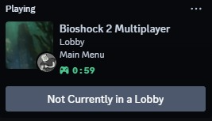

# Bioshock-2-Multiplayer-RPC

A Discord Remote Procedure Call (RPC) Program for Bioshock 2 Multiplayer which displays the users game status onto their Discord profiles.

# Notes

1. A Discord developer application is required in order to use the RPC.
2. Please view the Features section to see the current features of the RPC. Modify rpc_data.json to modify these features.
3. The RPC will crash if rpc_data.json is missing any information. Please do not remove values or information from this file.

### Setup Instructions

1. Navigate to the [Discord Developer Portal](https://discord.com/developers/applications).
2. Click on the "New Application" button located at the top right corner of the page.
3. Enter **Bioshock 2 Multiplayer** as the title of the application.
4. Copy the Application ID displayed on the subsequent page. Please ensure that this ID remains confidential.
5. Insert the Application ID into "APP_ID" in the `rpc_data.json` file located in the program directory. The file should be formatted as follows:
   ```json
    {
        "APP_ID": 123456789012345678,
        "MODE": "PERFORMANCE",
        "UPDATE_INTERVAL": 5,
        "BETA_ARCADIA": false
    }
   ```
6. Run Bioshock 2 Multiplayer with Discord opened.
7. Run the Bioshock 2 Multiplayer RPC and confirm the RPC is successfully connected.

### Features

1. **Two Performance Modes**: **REALTIME** and **PERFORMANCE** (Case-sensitive)

   - **REALTIME**: The RPC updates in real-time but may result in higher resource usage.
   - **PERFORMANCE**: The RPC updates less frequently, resulting in lower resource consumption.
2. **Custom Update Interval**

   - **UPDATE_INTERVAL**: When in PERFORMANCE mode, users can specify the interval between each RPC update. The maximum interval is 10 seconds per update.
3. **Custom Arcadia Image**
   
   - **BETA_ARCADIA**: When *true* will use the Beta Arcadia thumbnail for Arcadia on your discord profile. Please note true and false are case sensitive and must be lowercase.

# Screenshots

 
